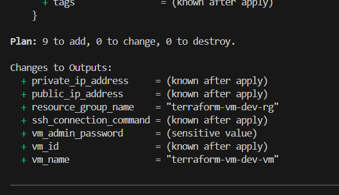
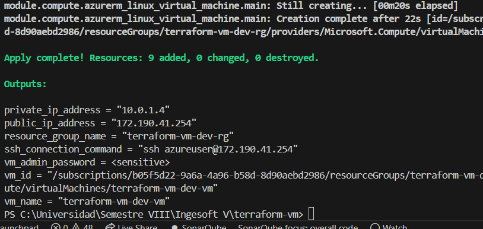
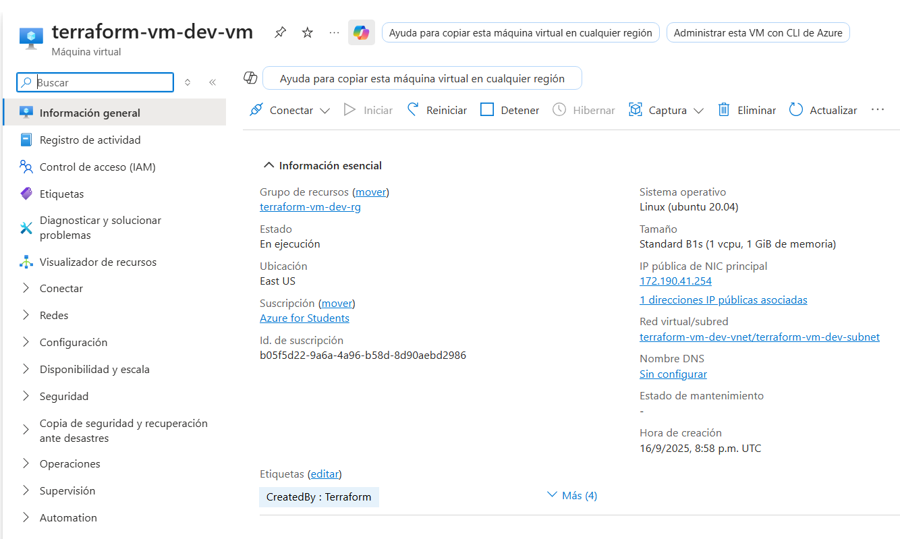
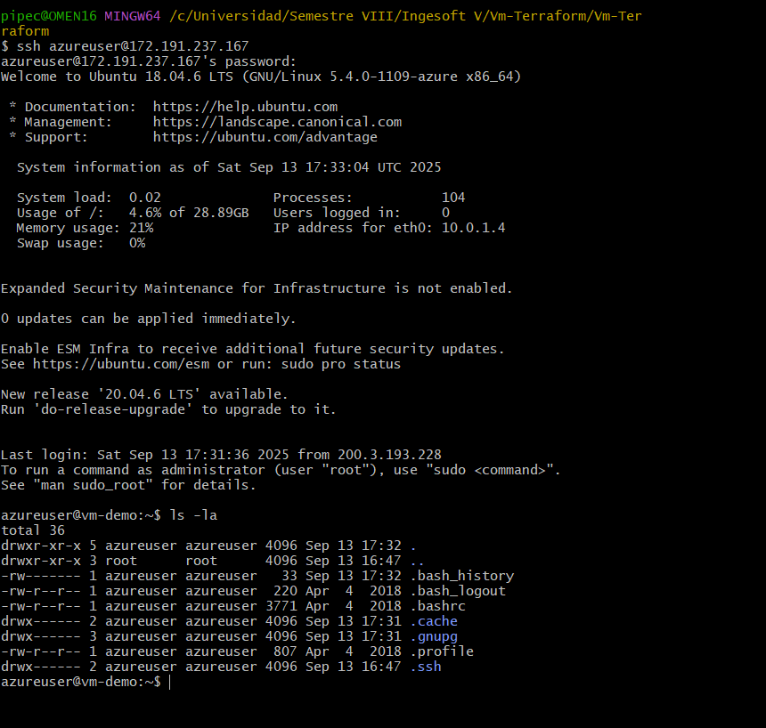
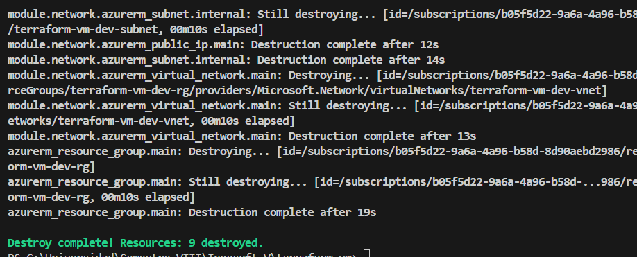

# 🚀 Despliegue de VM en Azure con Terraform

Este proyecto despliega una máquina virtual Linux en **Azure** usando **Terraform** con **autenticación por contraseña**.  
Incluye red virtual, subred, IP pública, grupo de seguridad y la VM lista para conectarse vía SSH.

---

## 📋 Requisitos previos

1. **Instalar Terraform**  
   [Guía oficial](https://developer.hashicorp.com/terraform/downloads)

2. **Instalar Azure CLI**  
   [Guía oficial](https://learn.microsoft.com/es-es/cli/azure/install-azure-cli)

3. **Iniciar sesión en Azure**  

```bash
az login
```

## ⚙️ Despliegue de la infraestructura

### Opción 1: Scripts automatizados (Recomendado)

```bash
# Desplegar
bash scripts/deploy.sh

# Destruir
bash scripts/destroy.sh
```

### Opción 2: Comandos manuales

```bash
# Configurar variables
cp terraform.tfvars.example terraform.tfvars
# Edita terraform.tfvars con tus valores

# Desplegar
terraform init
terraform validate
terraform plan
terraform apply

# Ver outputs
terraform output
```

🔐 Credenciales de acceso

El proyecto usa **autenticación por contraseña**. Configura tus credenciales en `terraform.tfvars`:

```hcl
admin_username = "azureuser"
admin_password = "TuPassword123!"
```

⚠️ IMPORTANTE: Cambia la contraseña por una segura antes de desplegar.

🖥️ Conectarse a la VM

Desde tu terminal, conéctate por SSH:
```bash
ssh azureuser@<PUBLIC_IP>
```

Sustituye <PUBLIC_IP> por el valor obtenido con `terraform output public_ip_address`.

Si quieres ejecutar un comando remoto sin entrar en sesión interactiva:

```bash
ssh azureuser@<PUBLIC_IP> "ls -la"
```

Para verificar el sistema operativo:

```bash
ssh azureuser@<PUBLIC_IP> "uname -a"
```
## Prueba de Conexión exitosa a VM


## 📋 Descripción

Este proyecto despliega una máquina virtual Linux en Azure utilizando Terraform con las mejores prácticas de DevOps, incluyendo:

- ✅ **Autenticación por contraseña** (sin claves SSH)
- ✅ **Arquitectura modular** para facilitar mantenimiento
- ✅ **Validaciones** y políticas de compliance
- ✅ **Configuración simplificada** con variables claras

## 🚀 Inicio Rápido

### Prerrequisitos

- [Terraform](https://www.terraform.io/downloads.html) >= 1.6.0
- [Azure CLI](https://docs.microsoft.com/en-us/cli/azure/install-azure-cli)
- Una suscripción de Azure activa

### 1. Configuración Inicial

```bash
# Clona el repositorio
git clone https://github.com/andrescabezas26/terraform-vm.git
cd terraform-vm

# Autenticarse en Azure
az login
# Configurar variables
cp terraform.tfvars
# Edita terraform.tfvars con tus valores específicos
```

### 2. Desplegar Infraestructura

```bash
terraform init
terraform validate
terraform plan
terraform apply
```

### 3. Conectarse a la VM

```bash
# Ver información de conexión
terraform output ssh_connection_command

# Conectarse por SSH (usando contraseña)
ssh azureuser@<PUBLIC_IP>
```

## 📁 Estructura del Proyecto

```
terraform-vm/
├── 📁 .github/workflows/      # GitHub Actions pipelines
├── 📁 modules/                # Módulos reutilizables
│   ├── 📁 compute/            # Recursos de cómputo
│   ├── 📁 network/            # Recursos de red
│   └── 📁 security/           # Configuración de seguridad
├── 📄 main.tf                 # Configuración principal
├── 📄 variables.tf            # Definición de variables
├── 📄 outputs.tf              # Outputs del proyecto
├── 📄 providers.tf            # Configuración de providers
├── 📄 validation.tf           # Validaciones y políticas
├── 📄 terraform.tfvars        # Ejemplo de variables
└── 📄 .gitignore              # Archivos ignorados
```

## ⚙️ Configuración

### Variables Principales

| Variable | Descripción | Valor por Defecto | Requerido |
|----------|-------------|-------------------|-----------|
| `project_name` | Nombre del proyecto | `terraform-vm` | ✅ |
| `environment` | Ambiente (dev/staging/prod) | `dev` | ✅ |
| `location` | Región de Azure | `East US` | ✅ |
| `vm_size` | Tamaño de la VM | `Standard_B1s` | ❌ |
| `admin_username` | Usuario administrador | `azureuser` | ✅ |
| `admin_password` | Contraseña del administrador | - | ✅ |
| `allowed_ssh_cidr` | IPs permitidas para SSH | `["0.0.0.0/0"]` | ⚠️ |

### Ejemplo de terraform.tfvars

```hcl
# Configuración del proyecto
project_name = "mi-proyecto-vm"
environment  = "dev"
owner       = "tu-nombre"

# Configuración de Azure
location = "East US"

# Configuración de la VM
vm_size        = "Standard_B2s"
admin_username = "azureuser"
admin_password = "password"

# ⚠️ IMPORTANTE: Cambiar por tu IP específica
allowed_ssh_cidr = ["203.0.113.0/32"]
```

## 🔒 Seguridad

Este proyecto implementa múltiples capas de seguridad:

- **Autenticación por contraseña** (configurable)
- **Reglas de firewall restrictivas** (solo IPs específicas)
- **Encriptación de discos** habilitada
- **Identidad gestionada** para integración con servicios Azure
- **Validaciones de compliance** automáticas

### Buenas Prácticas de Seguridad

1. **Nunca uses `0.0.0.0/0` en producción** para `allowed_ssh_cidr`
2. **Usa contraseñas seguras** con al menos 12 caracteres
3. **Rota las contraseñas regularmente**
4. **Usa Azure Key Vault para secretos sensibles**
5. **Habilita logging y monitoreo**


## Pruebas de Conexión Exitosa




